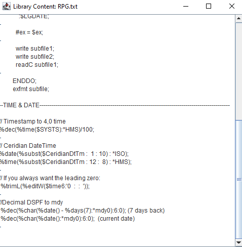
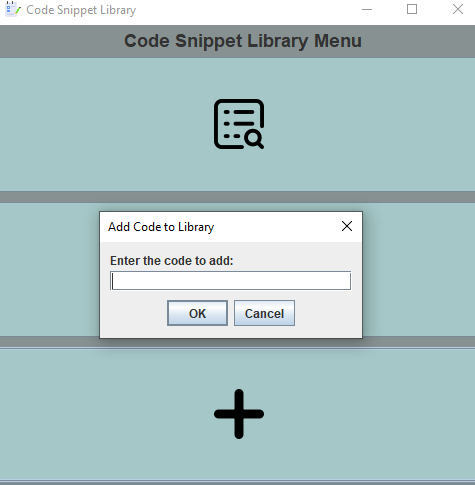

# Code Snippet Library GUI
The CodeSnippetLibraryGUI is a program that allows the user to create, view, and add to code snippet libraries. It has a Graphical User Interface (GUI) built using Java's Swing library.

## How to Run the Program
Clone the repository or download the source code files.
Open a command prompt or terminal and navigate to the directory where the files are saved.
Compile the CodeSnippetLibraryGUI.java file by typing javac CodeSnippetLibraryGUI.java and pressing enter.
Run the program by typing java CodeSnippetLibraryGUI and pressing enter.
Features
The CodeSnippetLibraryGUI program has three buttons:

## View: 
Allows the user to view existing code snippet libraries.
Create: Allows the user to create a new code snippet library.
Add: Allows the user to add code snippets from an existing library into another one.
The buttons have icons associated with them that are displayed on top of them instead of text, making for a more visually appealing GUI.
Edit: Allows the user to edit code snippets from an existing library.
Delete: Allows the user to delete code snippets from an existing library.

  
  
  
  
  

## Implementation Details
The CodeSnippetLibraryGUI class extends the JFrame class and implements the ActionListener interface. The ActionListener interface is used to detect button clicks and call the appropriate function to handle the event.

The GUI is created using Swing components such as JPanel, JLabel, JTextField, JTextArea, and JButton. The BorderLayout and FlowLayout layouts are used to position the components on the GUI.

When the user clicks the "View" button, the viewExistingLibraries function is called, which checks if there are any code snippet libraries in existence, and if so, prompts the user to choose one from a list of options. Once chosen, it reads that file's contents and displays them in a new window for viewing purposes only (no editing).

When the user clicks the "Create" button, the createNewLibrary function is called, which prompts the user to enter a name for the new code snippet library. It then creates a new file with that name in the current directory.

When the user clicks the "Add" button, the addCodeToLibrary function is called, which prompts the user to choose a source library and a destination library. It then reads the contents of the source library and appends them to the end of the destination library.

## Notes
The program assumes that code snippet libraries are stored as .txt files in the same directory as the program.
The GUI does have editing or deleting features, to format or delete specific code you can from the view section. You will be promted to save the update or not.
The program is not optimized for large code snippet libraries or multiple users accessing the same libraries simultaneously.

### Author and Version
This program was created by Jacob Jonas and is currently at version 1.0.
